# Batuhan Özcan

**Flutter Developer & Game Designer**

Welcome to my GitHub! I’m passionate about crafting engaging mobile apps using Flutter and exploring innovative app and game design. Feel free to explore my projects below.

---

## About Me

- **Current Focus:** Developing apps with Flutter (started with Kotlin)
- **Open to:** Opportunities and collaborations in Flutter development
- **Contact:** [batuhanozcan1605@gmail.com](mailto:batuhanozcan1605@gmail.com)

---

## Projects

### Contents

1. **BasevenueWolf:** Fastest way to bring your game to Web3.
2. **Kim Bilebilir?:** Real money priced knowledge competition.
3. **Pursuits:** AI based bite-size knowledge app that gives interesting information about anything.
4. **Miebu: Mindful Eating Buddy:** Supportive yet realistic day tracking for eating disorder. (AI supported)
5. **Strong Week - Week Planner:** A simplistic week planner.
 
Below you'll find a list of my projects, each detailed with an overview, key technologies, and visual previews. Common attributes of my projects are that they are written in Flutter/Dart and their UI designs are responsive.

### Project Title 1: BasevenueWolf
**Explanation:**  
BasevenueWolf is the blockchain and AI-powered alternative to RevenueCat, bringing seamless product management and revenue analytics to Web3 Applications.
The aim of the project is onboarding Web2 developers to Web3 easily.
The project is formed in the ETHGlobal AI Agent Hackathon in 9 days as POC.
My main role was frontend development for this project. I also have developed the basevenuewolf_sdk package to be able to use our project in development of other projects and a main screen for the 1-page game for demo purpose. Eventually, we have connected the sdk and the demo game succesfully via an API that is developed by my backend teammate. 

**Technologies, Abilities & Packages:**  
- Web 3 Dart
- Blockchain Wallet Connect
- Provider
- Request-response handling to AI API with http
- SDK development
- Firebase hosting  

**Link:**  
[View Project on GitHub](https://github.com/batuhanozcan1605/basevenue_wolf) and
[View SDK package on GitHub](https://github.com/batuhanozcan1605/basevenue_wolf_sdk)

[View project live](https://basevenuewolf.web.app/) (You need metamask extension in your browser to continue)

### Project Title 2: Kim Bilebilir?
**Explanation:**  
Kim Bilebilir? is a hint based knowledge competition that gives real money price. It was a freelance job for me and I have succesfully delivered. The target region is Turkiye.

 

  
  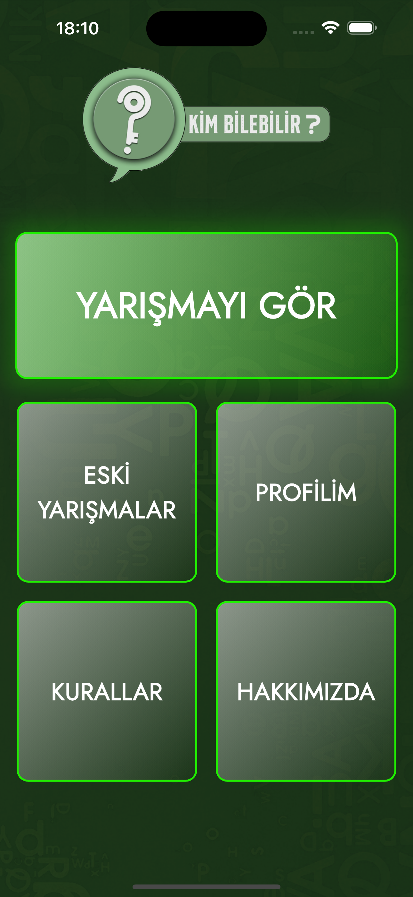

**Technologies, Abilities & Packages:**  
- MVVM, Clean Architecture, Provider
- Revenuecat integration
- Admob integration
- Publishing in App Store and Play Store
- Firebase Cloud Messaging for both platforms
- Firestore db
- Firebase remote configurations
- Firebase realtime db for server timestamp
- Admin Panel creation and Firebase hosting 

**Link:**  
Source code is in private for some security reasons.
[View Project in Play Store](https://play.google.com/store/apps/details?id=com.hilmican55.kimbilebilir)  
[View Project in App Store Beta Test in Test Flight](https://testflight.apple.com/join/aWkXThxy)  
It is currently in review for App Store. 

### Project Title 3: Pursuits
**Explanation:**  
Pursuits is an app that users can get personalized bite-size knowledge according to their interests. It is AI based so like its competitors Pursuits do not have static data and categories. Thus, user may type any topic they want to get inform.

  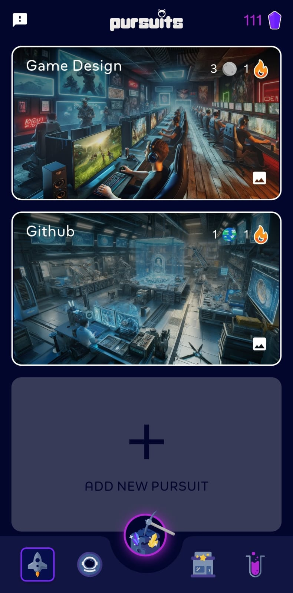
  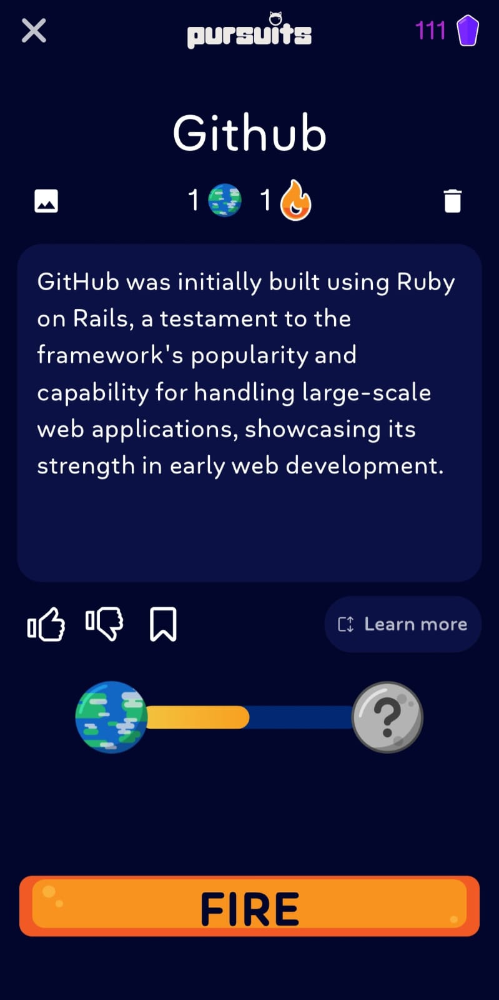
  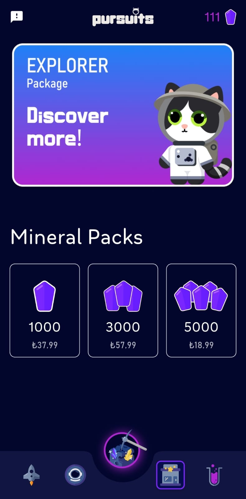
  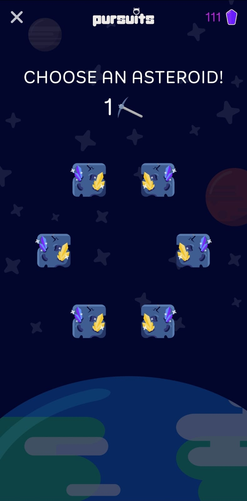

**Technologies, Abilities & Packages:**  
- MVVM, Clean Architecture, Provider
- Firebase Cloud Functions written in .js
- AI API Usage
- Publishing in App Store and Play Store (it's unpublished in both platforms)
- Firebase Cloud Messaging for both platforms
- Firestore db
- SQLite
- Revenuecat integration
- Admob integration
- Animated UIs

**Link:**  
Source code is in private for some security reasons. I am going to disable the OpenAI API keys first.
The app is published in Google Play Store once but I have retract the app. I will publish in 2 platforms soon. 
[View Project in App Store Beta Test in Test Flight](https://testflight.apple.com/join/agfJUekn)  
[The Google Gemini Compeition Video](https://www.youtube.com/watch?v=Ha5qZPvW2OA) 

---

### Project Title 4: Miebu: Mindful Eating Buddy

**Explanation:** 
Supportive yet realistic day tracking app for eating disorder. The main feature and idea is blind calorie tracking. Because a person who have eating disorder should not do that but still they shoul keep track of what they have eaten. AI assistant in the app allows you to enter the meals easily and it calculates the calories in background. You can see which zone you are currently in with color indicators. (Green-Yellow-Red)

  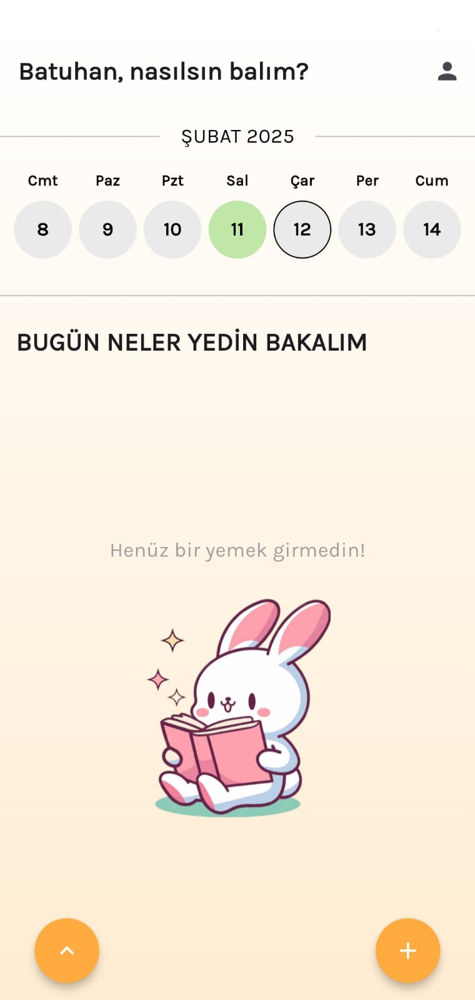
  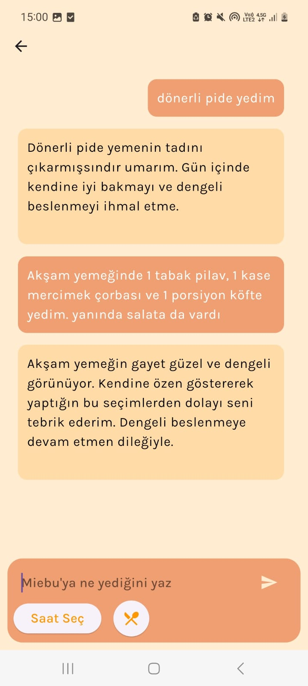
  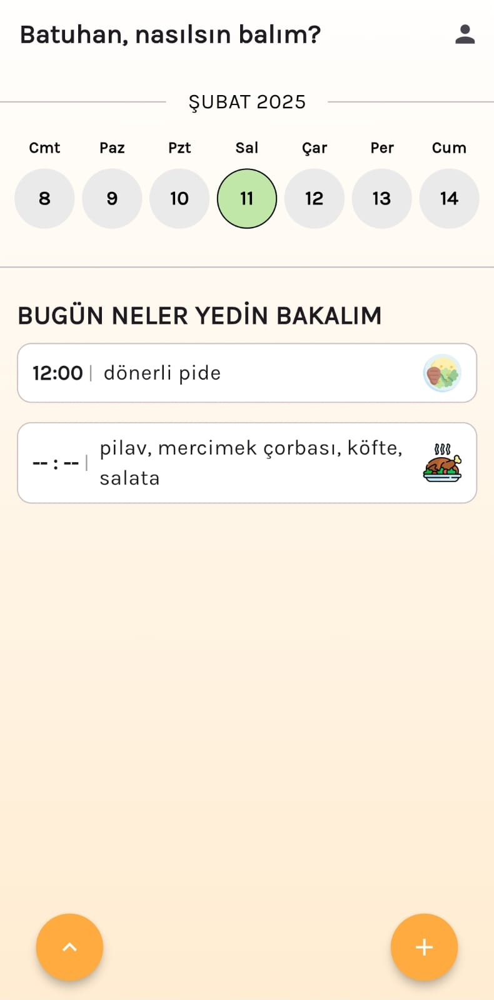
  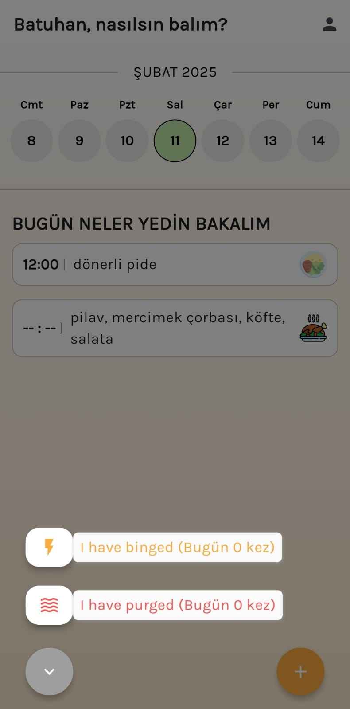

**Technologies, Abilities & Packages:**  
- MVVM, Clean Architecture, Provider
- AI API Usage
- Firebase Cloud Messaging for both platforms
- Firestore db

### Project Title 5: Strong Week - Week Planner

**Explanation:** 
A simplistic and useful weekplanner. Syncfusion's calendar package is used and I have pushed the limits of a pre-made package. (1 error of the package is found and notified to syncfusion company)

  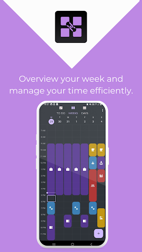
  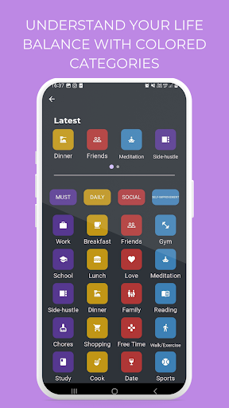
  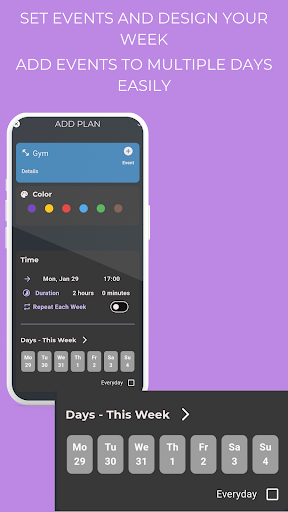
  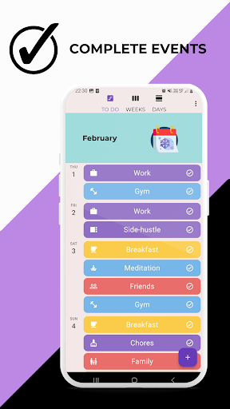

**Technologies, Abilities & Packages:**  
- MVVM, Clean Architecture, Provider
- State Notifiers
- Localization to many languages
- RevenueCat
- syncfusion_flutter_calendar package
- SQLite

## Let's Connect

Feel free to explore my repositories and get in touch if you're interested in collaborating or learning more about my work.

You can reach me at: [batuhanozcan1605@gmail.com](mailto:batuhanozcan1605@gmail.com)
